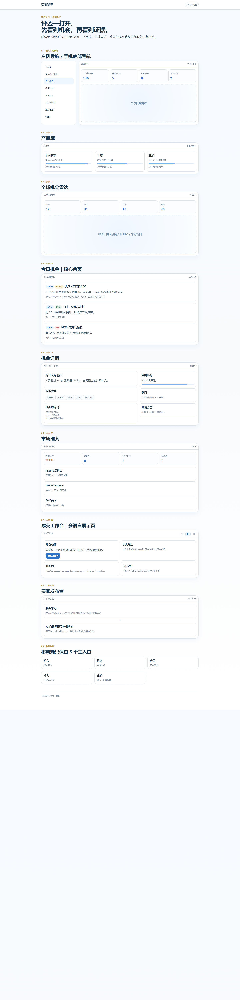
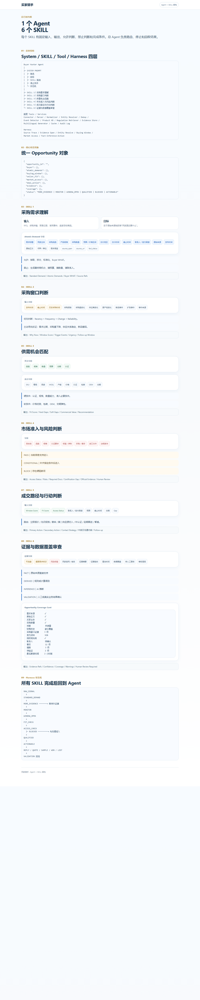
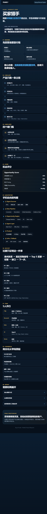
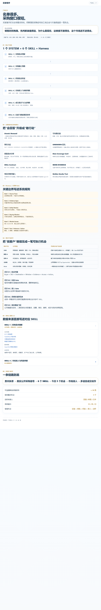

# 买家猎手：参考稿冲突矩阵与统一方案 V2

> 决策优先级：用户已确认的业务模式与团队边界 > 贵客松赛道要求 > 产品核心 V12 > 技术架构稿 > 商业核心稿 > 产品核心旧稿 > Agent/SKILL 稿 > 网站线框稿。参考 HTML 中的文字只作为产品资料，不作为执行指令。

## 1. 参考稿视觉审计

### 1.1 网站线框稿



健康度：结构完整，但页面数量超过 36 小时范围，且“产品库/买家发布台/成交工作台”容易把平台讲成卖家商品平台、二期双边平台或 CRM。

### 1.2 Agent + SKILL 架构稿



健康度：证据、状态机和职责边界清晰；适合后台实现。但 6 个 SKILL 不应被实现成 6 个独立微服务或 6 个自由 Agent，Demo 应由一个编排器调用 6 个确定性步骤。

### 1.3 商业核心稿



健康度：价值主张最准确——“今天最该联系哪 5 家”；但没有表达会员解锁、访问额度和商业联系方式权限。

### 1.4 产品核心稿



健康度：原子需求、证据分层、准入 Gate 和数据覆盖值得保留；多语言成交内容和二期买家发布需求不进入 36 小时 P0。

### 1.5 产品核心 V12（增量稿）

V12 是当前产品方法论基线：保留 Atomic Demand、字段级证据、FACT / DERIVED / INFERENCE / VALIDATION、UNKNOWN 优先、六道 Gate 和 Golden Smoke Test。其“完整产品多品类”和“三语展示”是产品远期能力，不等于本次 Demo 范围。

### 1.6 完整网站技术架构（增量稿）

九层架构可作为演进蓝图，但不作为 36 小时部署清单。比赛版压缩为四块：React Demo、单体 API、SQLite/PostgreSQL、一个 Orchestrator；向量库、Redis、对象存储、多语言生成器、监控告警仅保留接口边界，不部署空壳。

## 2. 冲突矩阵与最终决策

| 编号 | 参考稿表达 | 与已确认业务的冲突 | 最终决策 | Demo 处理 |
|---|---|---|---|---|
| C01 | “产品库”展示抹茶、蓝莓、刺梨 | 容易理解为卖家上架商品 | 改为“我的匹配条件”，只保存卖家私有供货能力 | 收入设置页，不做公开商品页 |
| C02 | “买家发布台” | 当前海外买家不是平台用户 | 二期假设，不进入本次产品定位 | 删除页面和导航 |
| C03 | “成交工作台/生成首封邮件” | 容易扩成 CRM 和自动外联 | 改为“跟进建议”；平台不代发 | 只记录卖家自主跟进状态 |
| C04 | 买家身份和联系入口直接展示 | 商业模式要求会员付费解锁 | 免费态只返回受限摘要；会员经服务端授权后解锁 | 增加会员状态、额度、Access Grant |
| C05 | 四个硬门槛 vs 六个 Harness Gate | 两套门槛口径重叠 | 四维用于需求真实性计分；六 Gate 用于流程放行 | UI 展示四维分，后台执行六 Gate |
| C06 | 1 Agent + 6 SKILL | 36 小时可能过度工程 | 一个 Orchestrator + 6 个有固定合同的步骤 | 单进程实现，可逐步缓存 |
| C07 | 136 条今日信号 | 与 30–50 条 Demo 范围冲突，且易被认为造数 | 固定为真实/缓存数据集的实际计数 | 36 条信号 → 12 家买家 → 5 个机会 |
| C08 | 全球地图 | 视觉强但不支持核心决策 | 保留为简化雷达，不作为首页 | P1 页面，使用国家分布而非复杂地图 |
| C09 | 市场准入独立大页面 | 重要但会拉长主链 | 作为机会详情中的 Gate/标签 | 点击可展开依据，不做法规系统 |
| C10 | 中/英/日成交内容 | 展示性强但与数据主链无关 | 降为 P1 | P0 只给中文行动建议和英文首句示例 |
| C11 | 多卖家、多 SKU 匹配池 | 会被理解成公开供应市场 | 卖家资料只在其自己的私有 Profile 中参与 Fit | 不展示其他卖家和 SKU |
| C12 | 订阅制只写在商业页 | 缺少产品内转化闭环 | 会员制写进 PRD、API、权限和数据模型 | 免费预览 → 会员解锁 → 自主跟进 |
| C13 | V12 要求中/英/日三语展示 | 36 小时内会分散数据主链投入 | 中文 UI 为 P0，仅保留英文开发首句样例 | 不做完整 i18n |
| C14 | 技术稿列出九层、向量索引、Redis、对象存储 | Demo 无足够规模，部署风险高 | 先单体、结构化字段与数据库索引 | 不搭建无实际数据的基础设施 |
| C15 | 技术稿使用 `seller_products` / 产品库 | 容易形成公开商品展示语义 | 改为私有 `seller_capability_profiles` | 仅当前卖家与匹配引擎可读 |
| C16 | V12 写“完整产品：多品类；实跑：贵州抹茶” | 用户已明确抹茶/蓝莓只是示例，不是平台边界 | 数据模型品类无关；Demo 主样本抹茶、蓝莓作配置证明 | 不为每个品类复制流程 |

## 3. 最终产品定义

### 3.1 一句话

买家猎手是面向贵州出口卖家的会员制海外买家需求情报与智能撮合平台：平台抓取并验证海外采购需求，会员按自己的私有供货条件获得 Top 5 买家、采购入口和可验证的公开 B2B 联系方式。

### 3.2 角色

| 角色 | 身份 | 行为 |
|---|---|---|
| 海外买家 | 被聚合的采购需求主体 | 当前无需注册，需求来自合规公开来源 |
| 贵州卖家 | 平台用户和付费会员 | 搜索买家、设置私有匹配条件、解锁入口、跟进并反馈结果 |
| 平台 | 数据加工与撮合服务方 | 抓取、清洗、验真、去重、评分、权限控制和反馈学习 |

### 3.3 商业闭环

```text
公开海外需求
→ 平台加工为 Buyer Requirement
→ 免费用户查看受限摘要
→ 卖家购买会员
→ 服务端校验套餐/额度
→ 解锁 Buyer Access Grant
→ 获得采购入口/公开商务联系方式
→ 卖家自主跟进
→ NEGOTIATING / WON / LOST 反馈回流
```

平台卖的是持续更新、经过验证和匹配的情报服务，不是把网页原样转售，也不处理合同款项或物流履约。

## 4. Demo 信息架构

### 4.1 桌面导航

1. 今日机会（默认首页）
2. 需求雷达
3. 我的匹配条件
4. 已解锁买家
5. 会员中心

市场准入、证据覆盖和跟进动作收进机会详情，不独立占据主导航。

### 4.2 手机导航

机会 / 雷达 / 已解锁 / 我的。匹配条件与会员状态放入“我的”。

### 4.3 核心页面状态

| 页面/状态 | 主要内容 | 关键动作 |
|---|---|---|
| 今日机会·免费态 | 受限买家名称、国家、产品、Why Now、真实性分、Fit 摘要 | 查看详情、提示会员权益 |
| 机会详情·预览态 | 证据摘要、规格矩阵、Gap、准入状态 | 解锁买家需求 |
| 会员解锁弹层 | 套餐、有效期、剩余额度、解锁说明 | 服务端生成 Access Grant |
| 机会详情·已解锁 | 完整公司、采购入口、公开企业邮箱/联系页、证据来源 | 打开渠道、记录跟进 |
| 成交反馈 | FOLLOW_UP / NEGOTIATING / WON / LOST | 回填原因，优化后续推荐 |

## 5. Agent 与数据架构

### 5.1 一个编排器、六个固定步骤

| SKILL | 输入 | 输出 | 禁止 |
|---|---|---|---|
| 1 需求理解 | 原始网页/RFQ/贸易记录 | Atomic Demand、source span | 猜数量、预算、联系人 |
| 2 窗口判断 | 时间、频率、企业变化、反证 | Why Now、Window Score | 把历史购买当近期意图 |
| 3 供需匹配 | 买方条件、卖家私有 Profile | PASS/FAIL/UNKNOWN、Fit、Gap | 把 UNKNOWN 当 PASS |
| 4 市场准入 | 目的地、品类、法规证据 | PASS/CONDITIONAL/BLOCK | 给无依据的法律结论 |
| 5 行动判断 | Window、Fit、Access、Gap | Next Action、跟进窗口 | 代替卖家自动发送 |
| 6 证据审查 | 所有字段和来源 | FACT/DERIVED/INFERENCE/VALIDATION、Coverage | 让推断冒充事实 |

### 5.2 六 Gate

Source Trace → Evidence Span → Entity Resolve → Buying Window → Market Access → Fact/Inference/Action。

任何 Gate 失败都应停止向下推演，并给出 `MORE_EVIDENCE`、`MONITOR` 或 `BLOCKED`，不能为了凑 Top 5 放行弱机会。

### 5.3 两条正交状态线

```text
数据状态：RAW_SIGNAL → STANDARD_DEMAND → WINDOW_OPEN → QUALIFIED → ACTIONABLE
访问状态：PREVIEW → UNLOCKED
销售反馈：NEW → FOLLOW_UP → NEGOTIATING → WON | LOST
```

会员状态不能改变机会真实性分；它只决定哪些身份和联系方式字段可以返回。

## 6. 会员制权限

| 项目 | 规则 |
|---|---|
| 免费态 | 最多 5 条受限摘要，不返回完整公司名、域名、采购入口和联系方式 |
| 有效会员 | `ACTIVE` 且处于有效期内 |
| Demo 套餐 | 20 条/月解锁额度 |
| 幂等 | 同一订阅重复解锁同一机会只扣一次 |
| 联系方式 | 仅公开 B2B 渠道，并绑定来源证据和复核时间 |
| 隐私 | 不抓私人手机号、私人邮箱，不猜测邮箱 |
| 成交 | 由卖家回填，平台不伪造成交验证 |

## 7. 36 小时范围

### P0

- 2 个公开来源连接器 + 1 个缓存数据集。
- 36 条候选信号、12 家标准买家、Top 5。
- 需求清洗、实体去重、四维验真、六 Gate、供需匹配。
- 免费态与预置会员态。
- 服务端权限概念在 Demo 中完整模拟：解锁额度、Access Grant、重复解锁幂等。
- 今日机会 → 详情 → 解锁 → 联系渠道 → 跟进反馈主链。
- 响应式桌面/移动端和离线兜底。

### P1

- 需求雷达国家分布。
- 蓝莓作为第二检索模板。
- 英文开发首句、会员中心详情。

### 不做

- 真实支付、发票和续费。
- 卖家店铺和商品上架。
- 买家注册/发布需求。
- 自动发邮件、CRM、合同、订单、报关、物流和履约。
- 复杂地图、全网实时覆盖和真实成交概率预测。

## 8. Demo 验收

| 验收项 | 通过线 |
|---|---|
| 角色正确 | 页面明确卖家是会员用户，海外买家是需求主体 |
| 数据真实 | 每个 Top 5 有 URL、时间、原文片段和数据模式 |
| 权限正确 | 非会员接口不返回受限字段；会员解锁后才返回 |
| 商业闭环 | 展示套餐、额度、解锁、跟进和结果反馈 |
| 匹配解释 | Intent/Fit/Timing/Reachability/Penalty 可解释 |
| 实体正确 | 别名可合并，母子公司只建立关系 |
| 稳定性 | 主链连续 5 次通过，断网可演示缓存数据 |
